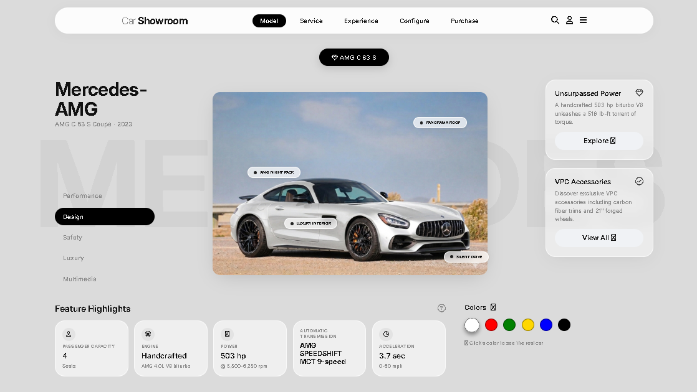

# 🚗 Luxury Car Showroom

A responsive, interactive car showroom landing page built with vanilla HTML, CSS, and JavaScript — showcasing the **Mercedes-AMG C 63 S Coupe**.

---

## 📁 Project Structure

```
project/
├── index.html      # Main page structure
├── style.css       # Styling & layout (CSS variables, grid,)
├── script.js       # Dynamic behavior (color switcher, car image swap, pins)
└── README.md       # Description, features, and instructions (this file)
```

---

## ✨ Features

- **3-column responsive grid** — title/tabs · car viewer · info cards
- **Interactive color switcher** — click a color dot to swap the real car image
- **Hotspot pins** — clickable overlays on the car image (Panorama Roof, Engine, etc.)
- **Feature highlights bar** — passenger capacity, engine spec, power, transmission, 0–60 time
- **Smooth anchor navigation** — navbar links scroll to sections (Models, Service, Experience, Configure, Purchase)
- **Glassmorphism cards** — frosted-glass info cards with hover CTAs
- **Font Awesome icons** throughout the UI

---

## 🚀 Getting Started

No build tools or dependencies required — just open the file in a browser.

```bash https://github.com/elmeee-1/cars-showroom
# Clone or download the project, then:
open index.html
```

Or use VS Code's **Live Server** extension for hot reload during development.

---

## 🛠️ Tech Stack

| Technology | Usage |
|---|---|
| HTML5 | Page structure & semantic markup |
| CSS3 | Layout (Grid/Flexbox), CSS variables, glassmorphism |
| JavaScript (ES6+) | DOM manipulation, color/image switching |
| Google Fonts (Inter) | Typography |
| Font Awesome 6.5 | Icons |

---

## 🎨 Customization

### Adding a new car model

1. Add a new `<button>` in `.model-switcher` with `data-model="1"` (increment index).
2. In `script.js`, extend the models array with the car's title, subtitle, specs, and color image URLs.

### Adding colors

In `script.js`, add entries to the `colors` array for the model:
```js
{ label: "Obsidian Black", hex: "#1a1a1a", image: "images/c63-black.jpg" }
```

### Changing specs

All feature values (`#feature-engine`, `#feature-power`, etc.) are updated dynamically via JS — edit the model data object in `script.js`.

---

## 🐛 Known Fixes Applied

- Added missing **Font Awesome CDN** link (icons were invisible).
- Fixed **broken grid layout** — `.left-col` was not closed before `.center-col` and `.right-col`, nesting them incorrectly.
- Removed **duplicate `center-col` and `right-col`** elements that were incorrectly placed inside `.left-col`.
- Resolved **duplicate IDs** (`id="design"`, `id="experience"`) which are invalid HTML.

---
## 📸 Screenshots
